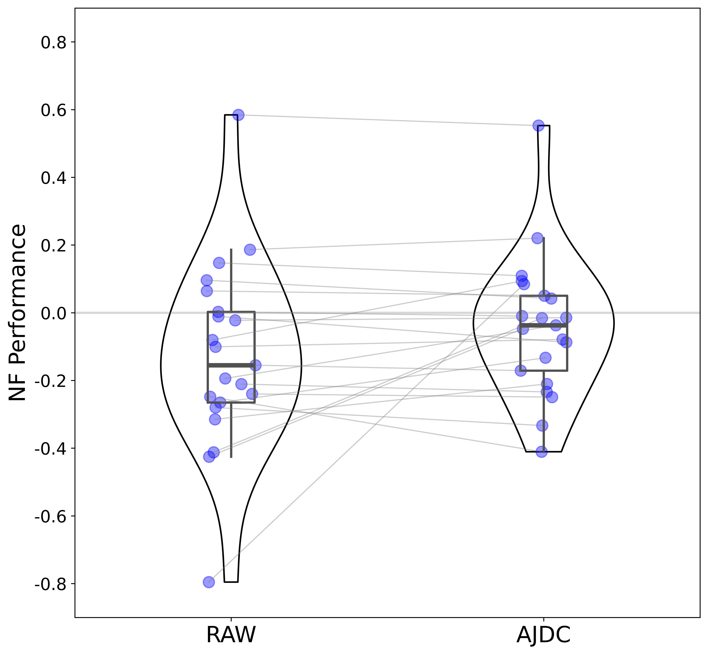

# Automatic Ocular Artifact Correction in Electroencephalography for Neurofeedback

---
This repository contains the code and supporting documents associated with the following manuscript:

C. Dumas, M.-C. Corsi, C. Dussard, F. Grosselin, N. George (2025). Automatic Ocular Artifact Correction in Electroencephalography for Neurofeedback. 
 
---
## Authors:
* [Cassandra Dumas](https://www.linkedin.com/in/cassandra-dumas-a002a2153/), PHD Student, Sorbonne Université, Institut du Cerveau (_alias_ [@Dumas-C](https://github.com/Dumas-C))
* [Marie-Constance Corsi](https://marieconstance-corsi.netlify.app), Inria Research Scientist, Sorbonne Université, Institut du Cerveau (_alias_ [@mccorsi](https://github.com/mccorsi))
* [Claire Dussard](https://www.linkedin.com/in/claire-dussard-92469a256/), PHD Student, Sorbonne Université, Institut du Cerveau (_alias_ [@cdussard](https://github.com/cdussard))
* [Fanny Grosselin](https://www.linkedin.com/in/fanny-grosselin/), Research Engineer, Sorbonne Université, CENIR, Centre MEG-EEG, Institut du Cerveau
* [Nathalie George](https://www.linkedin.com/in/nathalie-george-406a09167/), CNRS Research Director, Sorbonne Université, CENIR, Centre MEG-EEG, Institut du Cerveau

---
## Abstract

 Ocular artifacts can significantly impact electroencephalography (EEG) signals, potentially compromising the performance of neurofeedback (NF) and brain-computer interfaces (BCI) based on EEG. This study investigates if the Approximate Joint Diagonalization of Fourier Cospectra (AJDC) method can effectively correct blink-related artifacts and preserve relevant neurophysiological signatures in a pseudo-online context. AJDC is a frequency-domain Blind Source Separation (BSS) technique, which uses cospectral analysis to isolate and attenuate blink artifacts. Using EEG data from 21 participants recorded during a NF motor imagery (MI) task, we compared AJDC with Independent Component Analysis (ICA), a widely used method for EEG denoising. We assessed the quality of blink artifact correction, the preservation of MI-related EEG signatures, and the influence of AJDC correction on the NF performance indicator. We show that AJDC effectively attenuates blink artifacts without distorting MI-related beta band signatures and with preservation of NF performance. AJDC was calibrated once on initial EEG data. We therefore assessed AJDC correction quality over time, showing some decrease. This suggests that periodic recalibration may benefit long EEG recording. This study highlights AJDC as a promising real-time solution for artifact management in NF, with the potential to provide consistent EEG quality and to enhance NF reliability. 

## Code

This repository contains the code used to run the analysis performed and to plot the figures.
Computation and figures were performed with the following Python version: 3.12.4. In 'requirements.txt' a list of all the Python dependencies is proposed ..
Statistical analysis was performed with following R version: 4.4.1.

---
## Figures

### Figure 1a - Blink Evoked Potential

*
 Blink EPs for the conditions: RAW (left), AJDC-corrected (centre), ICA-corrected (right) signals. The grand average of the EPs across subjects is presented. At the top of each plot, topographies represent the spatial distribution of the blink EPs at t = 0 s corresponding to the blink peak. The inset boxes zoom in on the corrected EPs for better visualization of the differences between methods. Vertical axis: amplitude (µV); horizontal axis: time (s). 
*

### Figure 1b - Power Spectra on blink Evoked Potential

*
 Power spectra averaged on three scalp regions (from left to right: frontal, central, posterior) and averaged across subjects. Spectra derived from raw signals are represented in blue, those from AJDC-corrected blink epochs in orange, and those from ICA-corrected blink epochs in green. The lighter shaded area around each PSD represents the standard deviation across subjectts. Vertical axis: spectral amplitudes (dB) ; horizontal axis: frequencies (Hz). An inset on each plot shows the electrodes that were included in each scalp region.
*

### Figure 2 - Motor Imagery Signature

*
 Time-frequency representation of EEG power on each electrode of the Laplacian filter in RAW, AJDC and ICA conditions, during the NF trials. The grand average of the data across subjects is represented. The thin black dashed lines at 0 and 25 s represent the start and end of NF during the trials. ERD/ERS values are color coded, with the blue colors representing ERD and the red colors representing ERS. Vertical axis: frequencies (Hz) ; horizontal axis: time (s).
*

### Figure 3 - Comparison of NF Performance between RAW and AJDC conditions

*
 Blue dots represent individual data. For each condition, the thick horizontal black line is the median value across subjects, the box plot corresponds to the second and third quartiles, and the vertical these black lines correspond to the lower and upper quartiles (excluding outlier values). Violin plots of the individual data are also included. Vertical axis: NF performance; horizontal axis: conditions.
*

### Figure 4 - Difference in SNR between the first and last NF runs for each electrode

*
 The electrodes are colored according to their scalp region: frontal (red), central (green), and posterior (blue), corresponding to the same regions as in Figure 2. The size of the colored circle reflects the variability (standard deviation, SD) of the first vs. last run SNR difference across subjects. For visualization purpose, 3 circle size are represented: the larger circles represent the electrodes with a SD of SNR difference belonging to the 66% higher percentile of all SD values across electrodes, the medium size circles represent the electrodes with a SD value between 33% and 66% of all SD values, and smaller circles represent electrodes with a SD less than 33% of all SD values.
*
