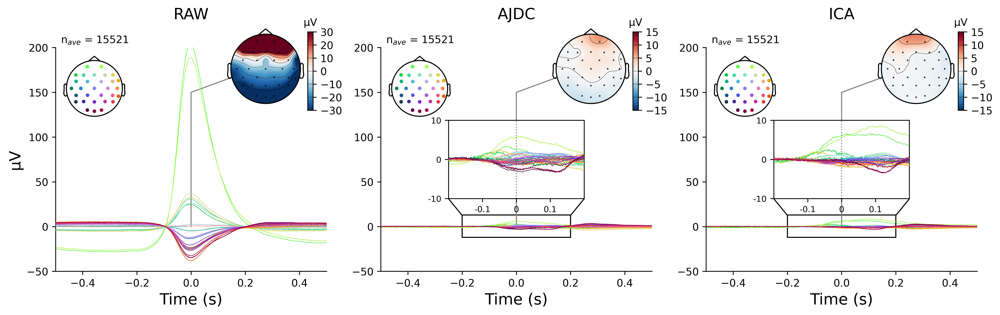
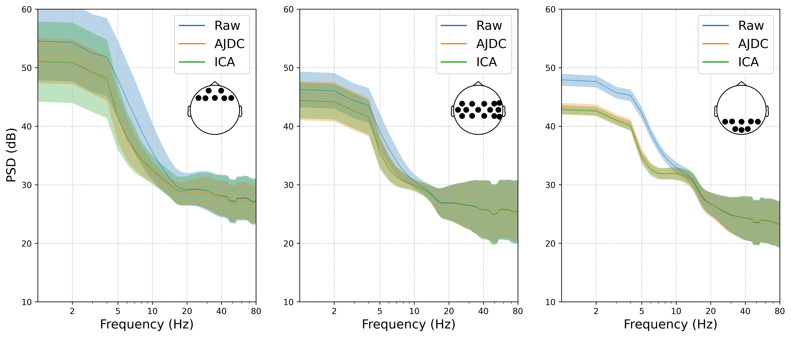
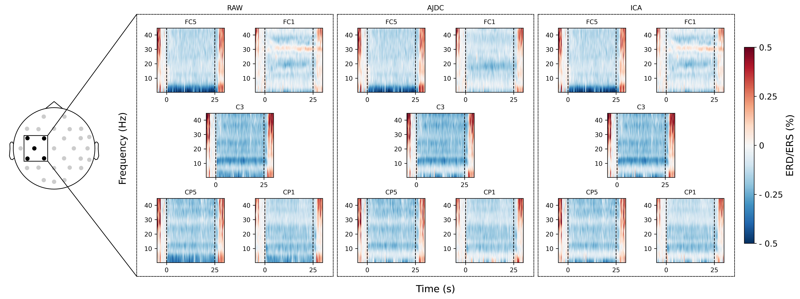
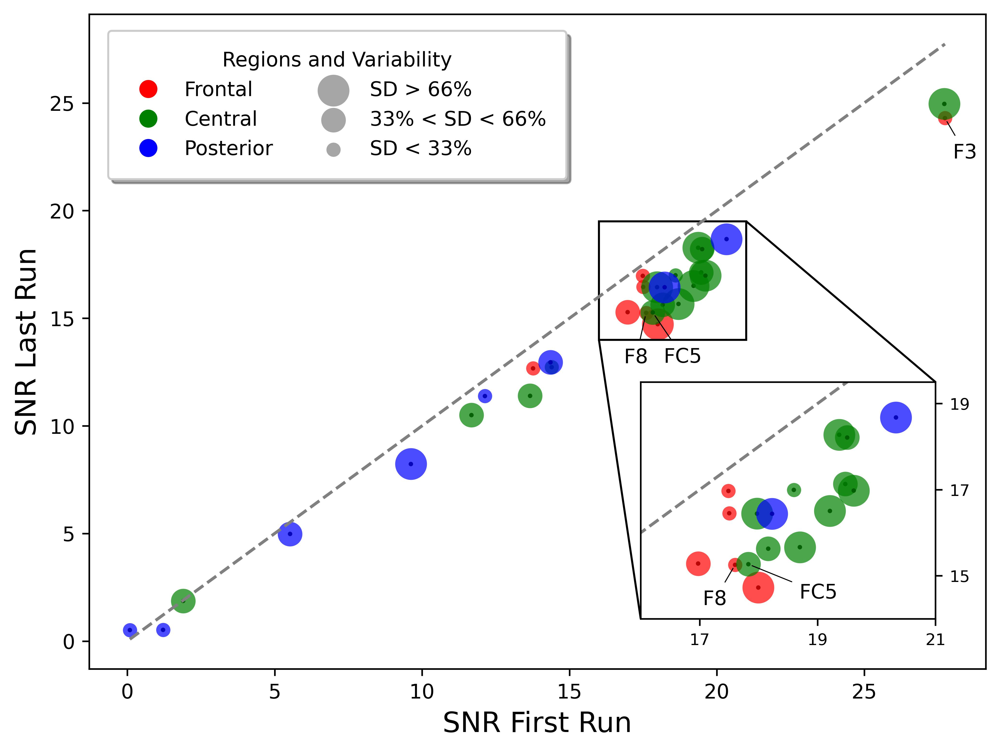

# Automatic Ocular Artifact Correction in Electroencephalography for Neurofeedback

---
This repository contains the code and supporting documents associated with the following manuscript:

C. Dumas, M.-C. Corsi, C. Dussard, F. Grosselin, N. George (2025). Automatic Ocular Artifact Correction in Electroencephalography for Neurofeedback. 
 
---
## Authors:
* Cassandra Dumas, Sorbonne Université, Institut du Cerveau
* [Marie-Constance Corsi](https://marieconstance-corsi.netlify.app), Sorbonne Université, Institut du Cerveau
* Claire Dussard, Sorbonne Université, Institut du Cerveau
* Fanny Grosselin, Sorbonne Université, Institut du Cerveau
* Nathalie George, Sorbonne Université, Institut du Cerveau

---
## Abstract
Ocular artifacts can significantly impact electroencephalography (EEG) signals, potentially compromising the performance of neurofeedback (NF) and brain-computer interfaces (BCI) based on EEG. This study investigates if the Approximate Joint Diagonalization of Fourier Cospectra (AJDC) method can effectively correct blink-related artifacts and preserve relevant neurophysiological signatures in a pseudo-online context. AJDC is a frequency-domain Blind Source Separation (BSS) technique, which uses cospectral analysis to isolate and attenuate blink artifacts. Using EEG data from 21 participants recorded during a NF motor imagery (MI) task, we compared AJDC with Independent Component Analysis (ICA), a widely used method for EEG denoising. We assessed the quality of blink artifact correction, the preservation of MI-related EEG signatures, and the influence of AJDC correction on the NF performance indicator. We show that AJDC effectively attenuates blink artifacts without distorting MI-related beta band signatures and with preservation of NF performance. AJDC was calibrated once on initial EEG data. We therefore assessed AJDC correction quality over time, showing some decrease. This suggests that periodic recalibration may benefit long EEG recording. This study highlights AJDC as a promising real-time solution for artifact management in NF, with the potential to provide consistent EEG quality and to enhance NF reliability.

## Code
This repository contains the code used to run the analysis performed and to plot the figures.
Analysis was performed with the following Python version: 3.12.4. In 'requirements.txt' a list of all the Python dependencies is proposed to plot the connectomes.
Statistical analysis was performed with following R version: 4.4.1.

---
## Figures

### Figure 1a - 

**

### Figure 1b - 

**

### Figure 2 - 

**

### Figure 3 - 

**

### Figure 4 - 

**